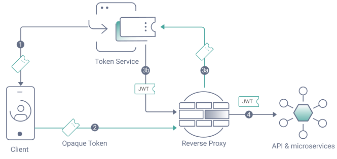
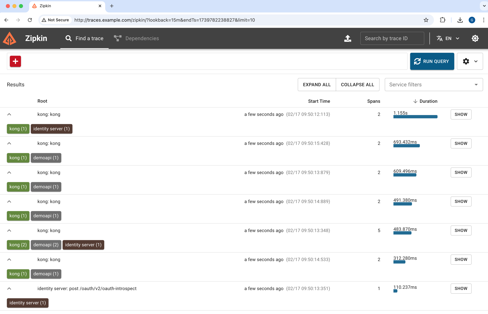
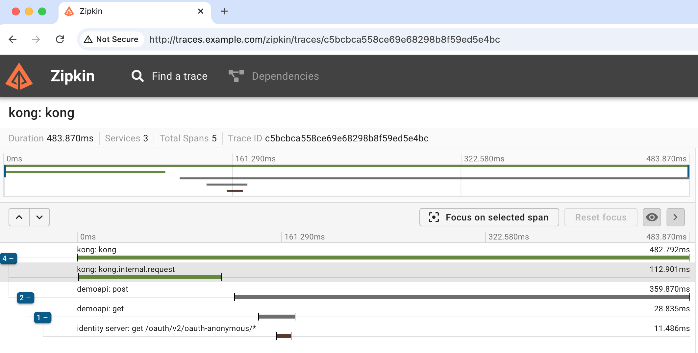

# OpenTelemetry OAuth End-to-End Tracing

An example end-to-end deployment for a phantom token flow that uses OpenTelemetry.

## Phantom Token Flow

The example uses a client that calls an API in a phantom token flow:



During an API request, each component generates OpenTelemetry spans within an overall trace.\
You can view all traces within an observability tool, within a TraceId that the client generates.



When required, OpenTelemetry provides visibility of subrequests, to simplify investigation of technical issues.



## Prerequisites

First copy a license file for the Curity Identity Server into the `idsvr` folder.\
Also ensure that your local computer has the following tools.

- A Docker engine
- Node.js 20 or later.
- OpenSSL 3 or later.

## Components

| Component | Location | Description |
| --------- | -------- | ----------- |
| Client | | A shell client that sends OAuth and API requests with a `traceparent` header. |
| API Gateway | | The Kong API gateway adds a span to the trace for all API gateway requests. |
| API | http://api.example.com | An example Node.js API that adds a span to the trace using the OpenTelemetry SDK. |
| Curity Identity Server | http://login.example.com | The Curity Identity Server adds a span to the trace for all OAuth requests. |
| OpenTelemetry Collector | | The OpenTelemetry collector receives and distributes trace data within the backend platform. |
| Zipkin | http://traces.example.com | The tracing frontend visualizes the end-to-end trace data. |

## Deploy the Backend

First add these entries to the local computer's `/etc/hosts` file:

```text
api.example.com login.example.com traces.example.com
```

Then run the following commands to deploy all backend components within a Docker Compose network.

```bash
./build.sh
./run.sh
```

## Run the Client

Wait 30 seconds or so, to ensure that all backend components are up.\
Then run a console client that initiates OAuth and API requests.

```bash
./democlient/run.sh
```

## Further Information

- See the [Technical Setup Notes](TECHNICAL-SETUP.md) for more information on the API and client.
- See the [OpenTelemetry Tracing Tutorial](https://curity.io/resources/learn/opentelemetry-tracing/) to learn more about OAuth end-to-end reliability.
- Please visit [curity.io](https://curity.io/) for more information about the Curity Identity Server.
