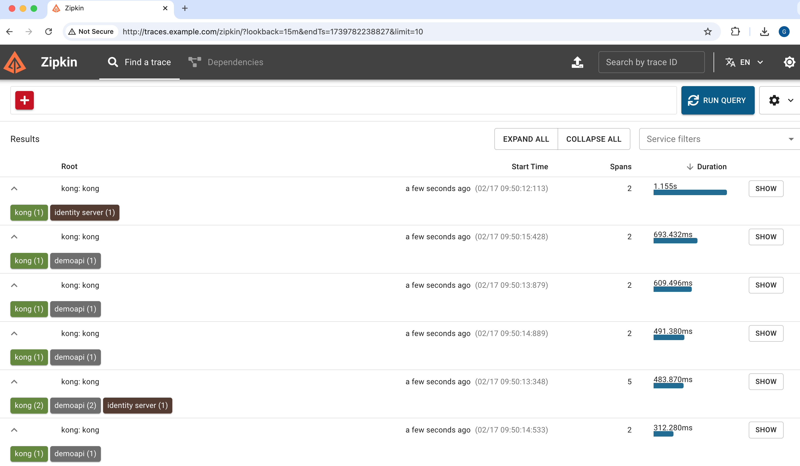

# OpenTelemetry Demo

An example end-to-end deployment for a phantom token flow that uses OpenTelemetry.

## Phantom Token Flow

The example uses a client that calls an API in a phantom token flow:


Each component generates OpenTelemetry trace and span IDs and you can analyze the trace data in an observability tool.\
The example shows all spans within the backend infrastructure, using the trace ID that the client creates:



When required, OpenTelemetry provides visibility of subrequests, to simplify investigation of technical issues:


## Prerequisites

First copy a license file for the Curity Identity Server into the `idsvr` folder.\
Also ensure that your local computer has the following tools:

- A Docker engine
- Node.js 20 or later.
- OpenSSL 3 or later.

## Components

| Component | Location | Description |
| --------- | -------- | ----------- |
| Client | | A shell client that initiates OAuth and API requests with a `traceparent` header. |
| API Gateway | | The Kong API gateway adds a span to the trace. |
| API | http://api.example.com | An example Node.js API that adds a span to the trace using the OpenTelemetry SDK. |
| Authorization Server | http://login.example.com | The Curity Identity Server adds a span to the trace. |
| OpenTelemetry Collector | | The OpenTelemetry collector receives and distributes trace data. |
| Zipkin | http://traces.example.com | The Zipkin frontend visualizes the end-to-end trace data. |

## Deploy the Backend

First add these entries to the local computer's `/etc/hosts` file:

```text
api.example.com login.example.com traces.example.com
```

Then run the following commands to deploy all backend components within a Docker Compose network:

```bash
./build.sh
./run.sh
```

## Run the Client

Wait 30 seconds or so, to ensure that all backend components are up, then run a console client that initiates OAuth and API requests:

```bash
./democlient/run.sh
```

## Further Information

- See the [OpenTelemetry Tracing Tutorial](https://curity.io/resources/learn/opentelemetry-tracing/) to learn more about OAuth end-to-end reliability with the Curity Identity Server.
- Please visit [curity.io](https://curity.io/) for more information about the Curity Identity Server.
